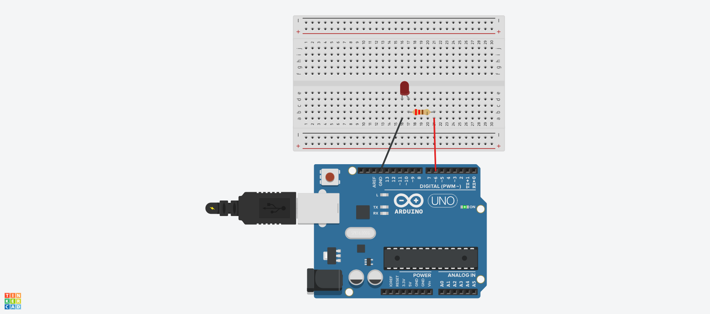

# Serial Data Read + LED

In this section, we read a data from serial line with baud rate `9600`


## Board Circuit Setup



- **Anode** of LED connected to **220 ohm (Red, Red, Brown)** resistor. 

- **Cathode** of LED connected to **GND** in arduino.

- **220ohm** resistor connected to **PIN6** in arduino.

So, the resistor of **220ohm** is connected in series from PIN6 to anode of LED, while cathode is connected to **GND** pin.


## Using Serial

- **Serial.begin(<baud_rate>):** Sets the data rate in bits per second (baud) for serial data transmission. For communicating with the computer, use one of these rates: 300, 1200, 2400,
4800, 9600, 14400, 19200, 28800, 38400, 57600, or 115200. You can,
however, specify other rates - for example, to communicate over pins 0 and 1 with a component that requires a particular baud rate. Normally use **9600** for arduino uno.

- **Serial.print(val, format_optional):** Prints data to the serial port as human-readable ASCII text. This command can
take many forms. Numbers are printed using an ASCII character for each digit. Floats are similarly printed as ASCII digits, defaulting to two decimal places. Bytes are sent as a single character. Characters and strings are sent as is. Examples:

    ```ino
    Serial.print(78) # gives “78”
    Serial.print(1.23456) # gives “1.23”
    Serial.print('N') # gives “N”
    Serial.print(“Hello world.”) # gives “Hello world.”

    Serial.print(78, BIN) # gives “1001110”
    Serial.print(78, OCT) # gives “116”
    Serial.print(78, DEC) # gives “78”
    Serial.print(78, HEX) # gives “4E”
    Serial.println(1.23456, 0) # gives “1”
    Serial.println(1.23456, 2) # gives “1.23”
    Serial.println(1.23456, 4) # gives “1.2346”
    ```

- **Serial.println(val, format_optional):** Prints data to the serial port as human-readable ASCII text followed by a carriage return character (ASCII 13, or '∖r') and a newline character (ASCII 10, or '∖n'). This command takes the same forms as Serial.print().

- **Serial.read():** Reads incoming serial data. read() inherits from the Stream utility class, takes **no parameter**. Returns the **first byte** of incoming serial data available (or -1 if no data is available) - int.

- **Serial.available():** Checks if there is any incoming data on serial line. Returns 0 if unavailable, else value greaer than 0.

